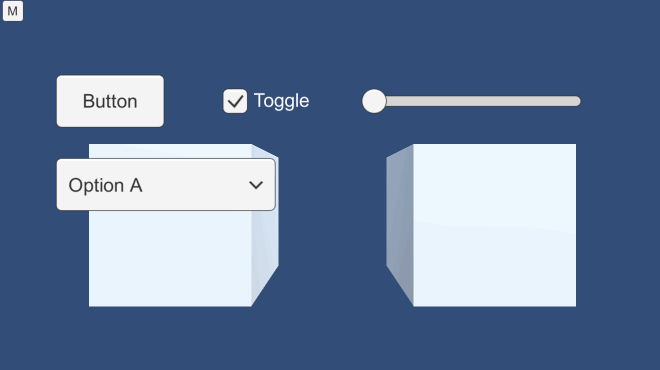

# UnityTouchRecorder

Record & Play touches for Unity iOS.

## What Is This?

UnityTouchRecorder is an experimental project to record & play touch inputs :point_down:.
The main purpose is to test apps automatically.

Happy game testing :)

## Demo

1. Open recording panel
1. Press "Start" to start recording
1. Touch the UI elements
1. Open recording panel
1. Press "Stop" to stop recording
1. Press "Play" to start playing the recorded touches
1. The touches are invoked automatically

## NOTE :memo:

The current version only supports iOS and it may have tons of bugs :bug:.
Issues and Pull Requests are always welcome.
